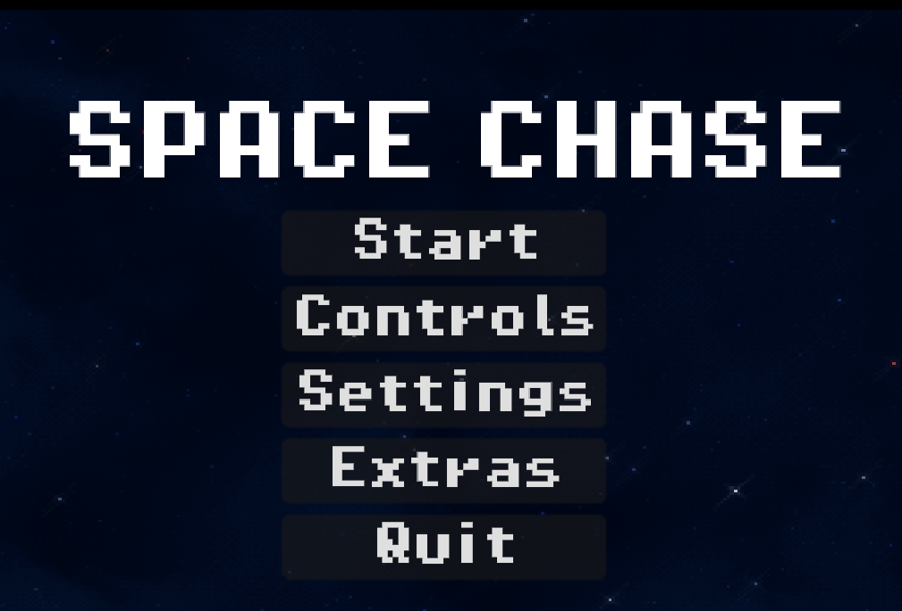
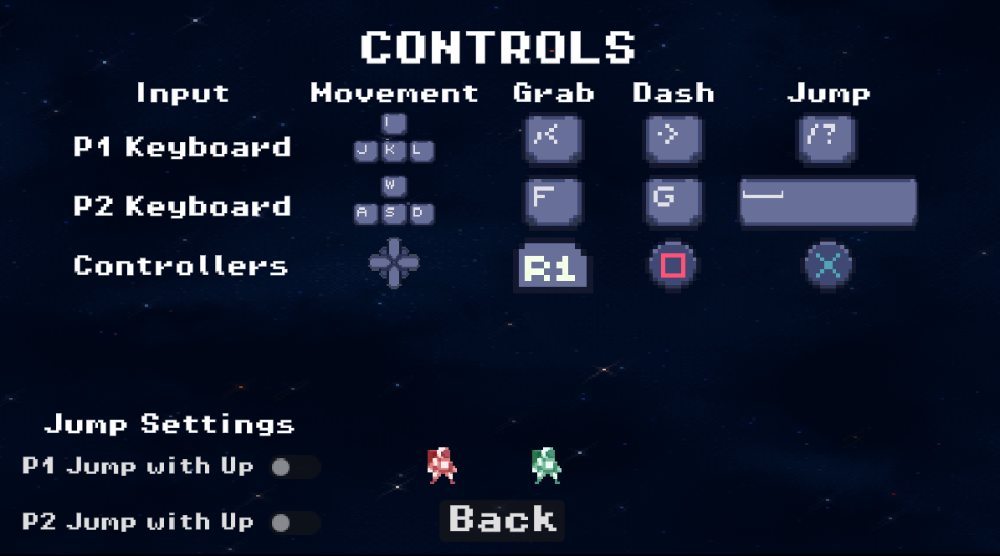
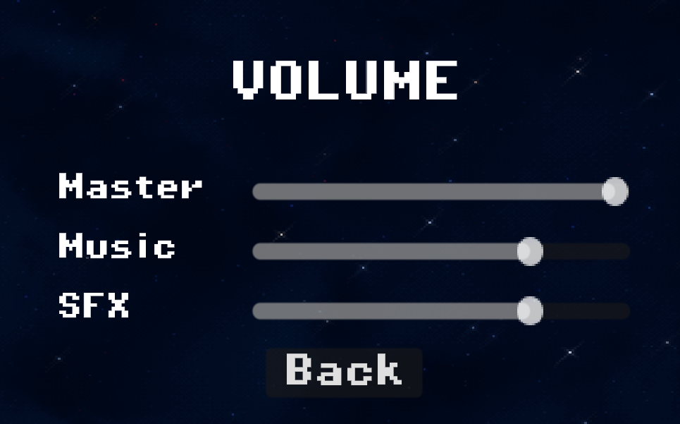
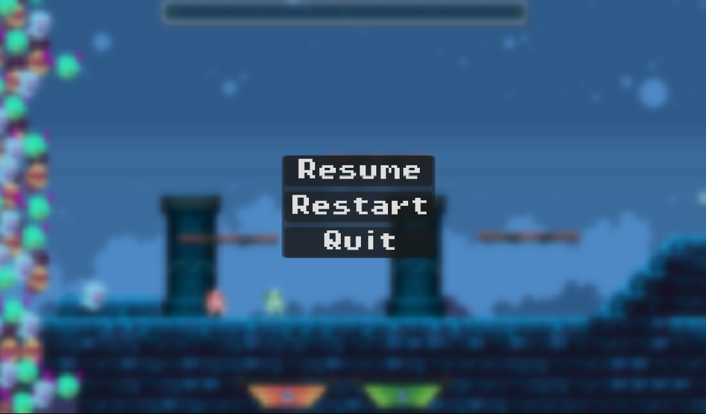
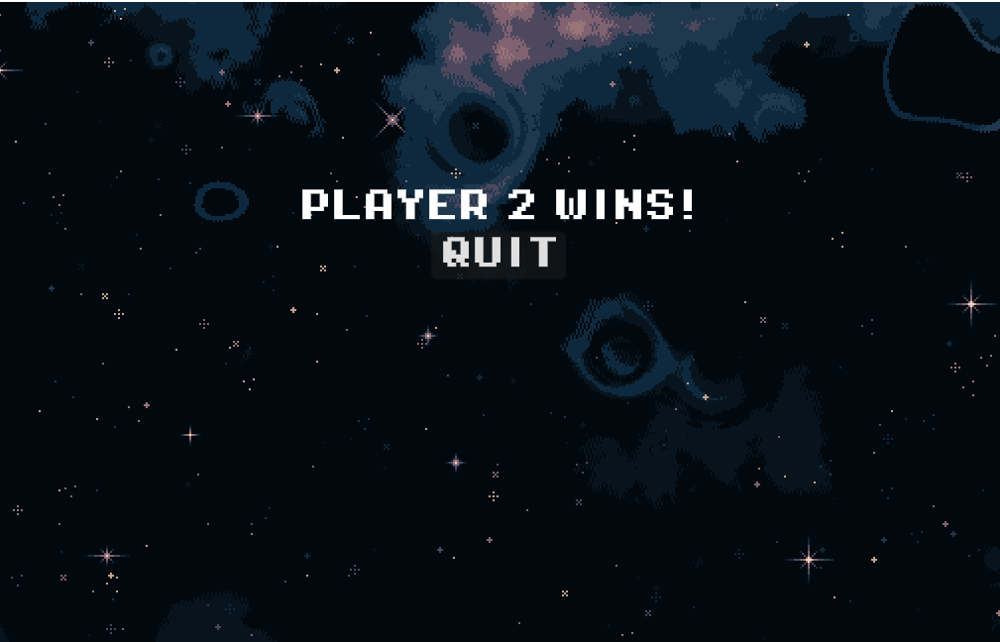
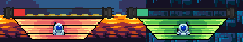

# Game Basic Information

## Summary

Space Chase is a two player racing game with platforming elements. This game takes inspiration from
[Celeste](https://store.steampowered.com/app/504230/Celeste/),
[SpeedRunners](https://store.steampowered.com/app/207140/SpeedRunners/), and [Super Smash Bros](https://www.smashbros.com/en_US/). Players have to race against each other to reach their ship first, however they would need to collect energy on the way to full charge their ship to win. A unique aspect is that the player can sabotage their opponent such as throwing them off the platforms or into spikes. Players can also dash, which can be utilized both for movement and offensive ability (stunning the player).

## Gameplay Explanation

The main goal of the game is to reach your ship while collecting as much energy as possible to refuel it.
However you will be competeing against an opposing player. Mechanics such as grabbing and throwing are at
your disposal to gain the upperhand against your opponent. Movement is also a huge part of this game and
serves are a core gameplay mechnaic. Borrowing the omnidirectional dash from Celeste it servers as an
extra tool for the player to traverse the deadly level and out run their opponent. There are also power
ups to level the playing field such as a speed boost or strength up.

# Main Roles

- Producer: [Carlos Huang](https://github.com/cahuang10)
- Movement and Physics: [Karim Shami](https://github.com/BoiPlex)
- Game Logic: [Jason Zhou](https://github.com/khromeengine)
- User interface and input: [Patrick Le](https://github.com/patple)
- Animation and Visuals: [Raghav Bajoria](https://github.com/RaghavsScarletSplendour)

## Producer (Carlos Huang)

### Organization Work

- To help brainstorm ideas for a game, I hosted a couple of meetings during the first week. During the meetings, I suggested ideas such as implementing a point system and power-ups. After the first week, there was no longer a need to meet online, but I would occasionally check in with my groupmates.
- I also created a GitHub repository. This allowed everyone to push their work from their own branch to the main branch. Ensuring that everyone worked on their own branch was helpful, as it allowed them to focus on their respective parts.
- It was important to make sure everyone followed the deadlines based on the schedule I helped create at the beginning of this project. The schedule was effective because people started working on different tasks, and it was mostly followed by everyone.

### Implementing power-ups

There were two aspects of the game that people were not working on: the power-ups and the enemies. Due to the limited amount of time given for this project, I decided to implement the power-ups. I created a base class for all the power-ups.

- The first class I created was `base_powerup.gd`. The class had an enum that assigned the six types of power-ups we have. This class also handled the player entering and picking up the power-ups. With the help of Karim Shami, we made the power-ups float up and down, which gave them a better game feel.
- I also created the `powerup_manager.gd` class. This class essentially applies and removes the effects of power-ups. I wanted to make a centralized class to handle the complexity of the power-up system. Additionally, I ensured that when the same power-up is picked up again before it runs out, the game increases the duration of the power-up's effect.
- Lastly, I made the `randomizer_powerup.gd` class. This class was more challenging for me because I was not familiar with animations and the preload function. For the animation, I combined all the sprites we had for the different types of power-ups and created an animation that cycles through the sprites. This is similar to Mario Kart's power-ups, where the power-up shuffles until the player picks it up.

### Poweru-ps:

#### GetBig:

This power-up grants the player the ability to double in size while gaining a strength boost that allows the player to throw opponents further.

#### GetSmall:

This power-up grants the player the ability to shrink in size while gaining the ability to double dash, which can be useful for escaping enemy grabs and traps.

#### Speed:

This power-up increases the player's movement speed.

#### Jump:

This power-up boosts jump height and distance.

#### Shield:

This power-up prevents the opponent from grabbing the player. It is a one-time-use power-up. Finally, it creates an vortex-like aura around the player. This was made using CUPparticles2d with a texture `effect_4.png`.

#### Energy:

Although not exactly a power-up, it behaves like one. When players collect this, they gain energy points to charge the ship at the end of the game.

## Movement and Physics (Karim Shami)

`text here`

## Game Logic (Jason Zhou)

`text here`

## User interface and input (Patrick Le)

### Main Menu

The main menu was the first thing I implemented when doing the UI. The script `menu_manager.gd`
organized and manages the whole menu system for our game. In there every menu state is declared as a enum and handles key features such as changing and entering between menus. Futhermore an addon was used to manage the multiple menu scenes. Helpful functions such as `change_scene` allowed us to move between menu states while also adding animated transitions. Most of the menus used are children of the menu manager. So `@onready var menu_manager: MenuManager = $".."` was very usful accessing functions within menu manager when changing menus. The structure of each menu scene has similar formatting with each other. Being some form of vbox container with a set of buttons, each withtheir own signal controlled by a script for that scene. Within each menu, besides the start and quit,
there is a "back" button which takes the player to last previous menu. Also each menu has an animated background, this was done by using a TextureRect and creating a shader to automatically scroll the texture, giving it an animated look.

### Controls Menu

For the controls menu it has all the keybinds for each player as well as the controller inputs. All the spirtes were contained in a Hbox conainter for easier editing and formatting. The only button that was in the controls menu was back which allowed the player to go to the main menu. The addition of having the players test the movement in the controls menu was both implemented by Jason Zho(Game Logic) and Karim Shami (Movement and Physics). This was done by adding the two players to the scene and adding invisible barriers.

### Settings Menu

This menu would lead to the sound setting menu where the player could adjust the master, music and sfx of the game. Jason implemented the sliders which was built into godot. The script would adjust the sound accordingly, such as updating the bus volume to the current slider value or muting sound when the
slider is at zero.

### Pause Menu

For the pause menu it was similarity built like the main menu, however it is not managed by the
`menu_manager.gd` thus not it's child. The 3 buttons that make up the pause menu are resume, restart, and quit. Using
`paused` boolen that is already in godot a function was made that pauses the current
scene. The pause menu is binded to the escape key so upon pressing it the current screne will be
paused and the menu will be made visible. If the player chooses to resume the scene will be unpaused
and the game will continue. For the restart button the game is unpaused and the current scene is
reloaded thus resetting any progress done. As for the quit, it will take the player back to main
menu. For the blured background of the pause menu a ColorRect was used with a shader to give the
blured effect. The whole pause menu scene was added to the autoscrolling camera since it allowed the pause menu to be in
view of the camera at all times when the player pressed pause. Also the z of this scene was placed at 11 to make it appear in front of all the objects in the camera.

### Ending Scene

The ending scene was created with the help of Karim who created the cutscene. Once the cutscene ends the name of the player will appear as well as a quit button to return the player back to the main menu.

### In-Game UI

 

There are two main aspects of the in-game UI. The level progress bar and the player energy bar. Both used functions from the gamestate manager
to get the current level progression and the player's eneryg. The game state manager was implemented by Jason. Using the [`get_level_progress`](https://github.com/ECS-179-Game-Project/Space-Chase-Game/blob/cf6b6518055fa3b0b0419af4be64a5942517d500/space-chase/scripts/game_state_manager.gd#L129)
function I was able to display the current's level progress on the bar at the top of the camera. While the energy bar of the player used a similar format of using [`get_player_energy`](https://github.com/ECS-179-Game-Project/Space-Chase-Game/blob/cf6b6518055fa3b0b0419af4be64a5942517d500/space-chase/scripts/game_state_manager.gd#L110)
from the game state manager to display the current energy of each player. The function simply returns the energy of the player ID passed through. Futhermore
the player would lose a fixed amout of energy upon death and that lost amount would be given to the other player. To implemente this the [instakill](https://github.com/ECS-179-Game-Project/Space-Chase-Game/blob/cb12d3fa9054d308f30a1e9c84a88861d3687b77/space-chase/scripts/player.gd#L261)
function inside the `player.gd` was modified so that players who died would have lost energy and the oposing player would have gained some.

### Input Devices

This was implemented with the assistance of Karim. He created a player [controls script](https://github.com/ECS-179-Game-Project/Space-Chase-Game/blob/7572aeca99ce3adfedc336fae82fce82ea16661b/space-chase/scripts/player_controls.gd#L1) where each player
had their own dedicated control list and inputs. Also in the input map settings you could add different devices. This allowed it the game
differentiate between two controllers. As for keyboard the player 1 was WASD was used while having F as grab and G being the dash. While player 2
used the arrow keys or IJKL if they didn't have arrow keys Comma was used for the grab, period was the dash and slash was for space

### UI Resources

- [How to make a Scrolling Background in Godot 4](https://www.youtube.com/watch?v=TMeT541OLPA&t=78s)
- [Make a Pause Menu in Godot in 5 Minutes!](https://www.youtube.com/watch?v=e9-WQg1yMCY)
- [Godot 4 Main Menu Beginner Tutorial](https://www.youtube.com/watch?v=vsKxB66_ngw)

### Assets used

- [Menu background](https://space-spheremaps.itch.io/pixelart-starfields)
- [Pevel progression bar and player banner icons](https://mattwalkden.itch.io/free-space-runner-pack)
- [Player energy bar](https://adwitr.itch.io/pixel-health-bar-asset-pack-2?download)
- [Parts of the player banner](https://bdragon1727.itch.io/basic-pixel-health-bar-and-scroll-bar)

## Animation and Visuals (Raghav Bajoria)

### Player Animations

The player character has a wide variety of animations designed to enhance gameplay and create a dynamic experience. These animations include:

- Idle: A static yet engaging pose to signal inactivity.
- Running: Basic running
- Jumping: Basic jump
- Dashing: A streak of orange behind the playe
- Grabbing: Player tilts to the right or left when pressed
- Held/Holding: Player holds the other player on top of their head
- Fast Falling: dash animation downwards
- Ghosting/Respawning (as Ghost/Normal): Player becomes opaque and washed with white
- Stunned: Displays the player's vulnerability when hit or sabotaged.
- Death (Die): Player shrinks when dead

These animations, though simple in implementation, contribute to the competitive and high-energy tone of the game. The animations were implemented using a state machine to seamlessly transition between different player actions. Player feedback reported that the animations felt very satisfying.

### Cutscene Animations

Cutscenes enhance the game's storytelling and immersion with animations such as:

Explosions: Spaceship and world explosions
Spaceship Movement: Spaceship movement to demonstrate entering, fighting and leaving the scene

Karim Shami played a major role in creating these animations, ensuring consistency and visual flair. Raghav helped with adjusting certain animations to provide a better visual experience.

### Sprites and Tilesheet

The sprites and tilesheets used in Space Chase were primarily sourced from pre-downloaded assets, ensuring high-quality visuals while saving development time.

These included:

- Character Sprites: Used for player animations like running, dashing, grabbing, and more.
- Environmental Tilesheets: Created the dynamic and visually distinct environments, such as platforms, traps, and backgrounds.

Karim Shami played a key role in helping find and implement assets, ensuring they aligned with the game's fast-paced and competitive aesthetic. Minor modifications were made to some sprites (e.g., grab animation) to better fit the gameplay mechanics.

### Challenges

The most challenging part of the process was setting up and fine-tuning the animation state machine, ensuring smooth and logical transitions between different states.

### Feedback and Iterations

Adjustments were made to the grab animation for smoother transitions based on playtesting feedback.
Overall, animations remained consistent with their initial designs.

### Audience Reception

The dash animation stood out as the most impressive feature, garnering praise for its visual impact and gameplay utility.

# Sub-Roles

- Press Kit and Trailer: [Carlos Huang](https://github.com/cahuang10)
- Narrative Design: [Karim Shami](https://github.com/BoiPlex)
- Audio: [Raghav Bajoria](https://github.com/RaghavsScarletSplendour)
- Gameplay testing / Level Design: [Patrick Le](https://github.com/patple)
- Game Feel & Polish: [Jason Zhou](https://github.com/khromeengine)

## Press Kit and Trailer (Carlos Huang)

## Trailer

I made a trailer using DaVinci Resolve. I came up with interesting text to describe what was happening during the trailer.
I recorded many trial gameplays with a friend so the audience could get a sense of what the game is about.
I looked for interesting audio I could use as background music and ensured that we had the rights to use it.

Here is the link to our [trailer](https://youtu.be/sAVLEPqOCx0)

## Press Kit

For the press kit, I decided to create it using Notion. I like its easy-to-use interface. I created a logo for our game along with a slogan. I added some important details about our game. I also took screenshots of parts of our map that I felt were important to include in the press kit.

Here is the link to our [press kit](https://deep-spleen-40e.notion.site/Space-Chase-156a4264007680478aeacbd30d0a2188?pvs=4)

## Narrative Design (Karim Shami)

`text here`

## Audio (Raghav Bajoria)

### Audio Collection and Implementation

- Sourced high-quality audio tracks and sound effects to match the project's tone and theme.
- Edited and trimmed audio to fit specific scenes and timing requirements.
- Converted audio files into the appropriate formats for seamless integration into the project.

### Animation Integration

- Synchronized animations with collected audio for a cohesive storytelling experience.
- Ensured smooth transitions between scenes with aligned audio and animations.

### Challenges and Solutions

- Challenge: Trimming and aligning audio to fit precise scene timings. Solution: Carefully reviewed and adjusted soundtracks using Quicktime Player to match visual cues and transitions.
- Challenge: Finding the correct audio to fit the game whilst also complying with the copyright and legal agreements. Solution: itch.io and opengamemart.org was a great resource to find the right fit.

### Assets used

_All under License.md_

## Gameplay testing / Level Design (Patrick Le)

[Full report can be seen here](SpaceChasegameplaytestingnotes.pdf)

### Gameplay feedback

- Most of the of the complaints seem to be the keybinds and the controls of the player. Most players did not
  like how the up movement was also the jump. It made it harder for them to jump diagonally. Futhermore other players had
  certian preferences for different controls. So example some people were find with the grab being right bumper while some
  would have perfered the right trigger. Futhermore from the testing people noted keybinds for when playing two players on a single keyboard
  was unplayable.

- Another suggestion we had was the difficulty of the level design. Although I intentionally designed the level to be hard
  with near impossible jumps I agree some trap and platform placement was unfair. So some map tweaks were made to make the level more
  enjoyable while also being not too hard. We also got some feedback of how the push box aspect of the camera
  was high risk high reward since the players would have less time to react to traps. This was intented
  and it was nice to see the play testers noticing.

- A number of players also commented about player and visablitly. Such as indecators for when the player
  respawn is going to happen, when the ships are fully charged, and a change of one of the player's color.
- Players also felt that the ghosting mechnaic was confusing and difficult to move around when ghosting causing them to respawn in wall and dying
  again.

### Adjustments after feedback

- The controls were changed for both controller and keyboard. For both devices the jump and up movement were seperated
  into two different inputs. This allowed the players to have more freedome when jumping to the left or right. It also
  made it easier to jump and dash midair. Another thing we changed for the controller was the dashing, instead of having it on the bumpers
  it was changed to square and triangle, while the jump was changed to X and circle. The grabbing was also changed to both triggers
  and both bumpers.
- As for gameplay clarity we have changed player 2's color from blue to green to improve player visablitly. I also increased the contrast
  of the background of the cave sections of the level since some complaints were that the background blended into the solid ground too much
  making it hard to see.
- To fix some issue with the ghosting we added an indecator such as the player binkingto show that the ghosting was ending and that the  
  player was going to respawn. We also made it so that the player could dash in when they are a ghost. This allows the player to recovoer more
  quickly from a bad spawn.

### Level Design

- The level design was very straight foward with with Raghav's(Animation and Visuals) implementation of the different tilesheets. I wanted to make the level hard yet not frustrating. Futhermore I wanted to add an emphasis of the trade off of using the push box to speed up the camera. So spike traps are randomly placed so that if a player is constantly using the push box why will run into since there is a very short window to react. Also to add more variation throughout the map there are hidden tunnels that led provide strong power-ups or lead you directly into a trap. Karim also helped with level design by providing more detail and decorations throughout the level.

## Game Feel & Polish (Jason Zhou)

`text here`

# Areas to improve

## UI and Input

- The controller support still needs more work. The main issue is that the if there is only one controller
  then that controller is assigned to player 1. This could lead to accessibility issues if player 1 wants to play on
  keyboard and player 2 wants to play on controller.
- Another thing we could have done was having customizable player inputs since in the current build the player controls
  are fixed and the only way to change them is through the project settings in godot
- Also adding network multiplayer would have been a nice thing to add as well since godot does
  have some support with online multiplayer.
