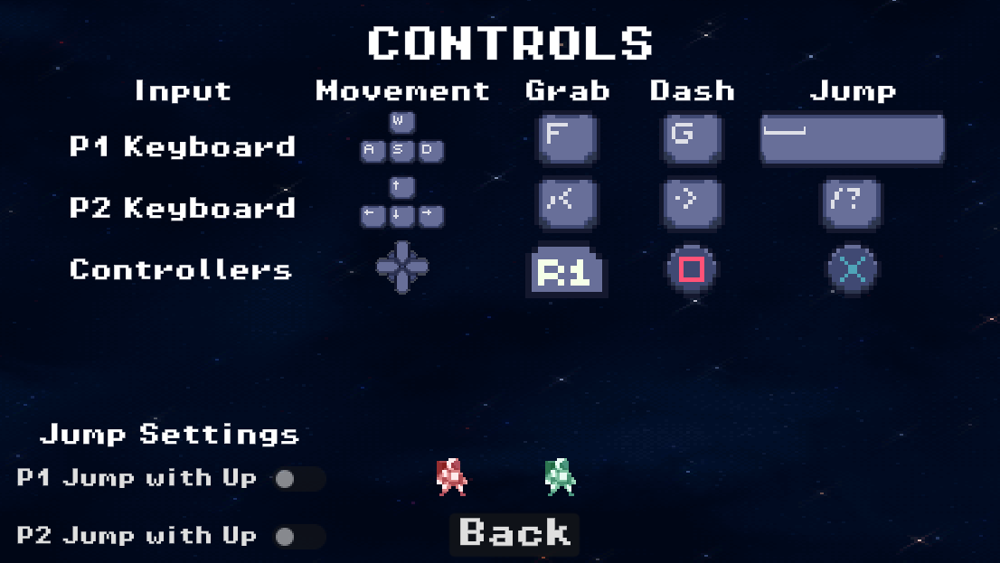
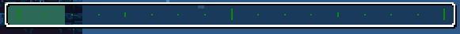

# Game Basic Information

## Summary

Space Chase is a two player racing game with platforming elements. This game takes inspiration from
[Celeste](https://store.steampowered.com/app/504230/Celeste/),
[SpeedRunners](https://store.steampowered.com/app/207140/SpeedRunners/), and [Super Smash Bros](https://www.smashbros.com/en_US/). Players have to race against each other to reach their ship first, however they would need to collect energy on the way to full charge their ship to win. A unique asspect is that the player can sabatoge their opponent such as throwing them off the platforms or into spikes. Players can also dash, which can be utlilized both for movement and offensive ability (stunning the player).

## Gameplay Explanation

The main goal of the game is to reach your ship while collecting as much energy as possible to refuel it.
However you will be competeing against an opposing player. Mechanics such as grabbing and throwing are at
your disposal to gain the upperhand against your opponent. Movement is also a huge part of this game and
serves are a core gameplay mechnaic. Borrowing the omnidirectional dash from Celeste it servers as an
extra tool for the player to traverse the deadly level and out run their opponent. There are also power
ups to level the playing field such as a speed boost or strength up.

# Main Roles

- Producer: [Carlos Huang](https://github.com/cahuang10)
- Movement and Physics: [Karim Shami](https://github.com/BoiPlex)
- Game Logic: [Jason Zhou](https://github.com/khromeengine), [itch.io page](https://khromeengine.itch.io)
- User interface and input: [Patrick Le](https://github.com/patple)
- Animation and Visuals: [Raghav Bajoria](https://github.com/RaghavsScarletSplendour)

## Producer (Carlos Huang)

`text here`

## Movement and Physics (Karim Shami)

`text here`

## Game Logic (Jason Zhou)

   As the head of Game Logic, I was in charge of implementing various systems overseeing game states and data and other 
   backend parts that are required for the game to function. To this end, I designed and implemented the [GameStateManager](https://github.com/ECS-179-Game-Project/Space-Chase-Game/blob/main/space-chase/scripts/game_state_manager.gd) 
   singleton / global script, the [charging stations](https://github.com/ECS-179-Game-Project/Space-Chase-Game/blob/main/space-chase/scripts/charging_station.gd),
   and the [camera](https://github.com/ECS-179-Game-Project/Space-Chase-Game/blob/main/space-chase/scripts/autoscroll_camera_controller.gd).
   
   
   Since Game Logic is important to get working sooner rather than later, most of my code on Game Logic was written 
   in our first week of work, including most of the GameStateManager and most of the camera. The charging station and
   related logic for charging in the game state were worked on but incomplete until the last week when our game was near completion.
   
   
   While I wrote most of the code in the first week, I continued to update and fix my code according to my team's needs over the span of the project.
   Details for this will be provided in the following sections. I also continued to consult for my team to make sure they can fulfill their roles
   when working on systems related to game state, particularly with Patrick, our UI lead. Occasionally, I redesigned game objects to be better
   integrated with the rest of the game.
   
   
   In this project, I followed no particular design pattern, but tried my best to keep code free from dependencies that might break the game.
   This is especially important, as the game state is very often accessed by many different objects.
 
   
   I originally planned to also implement menus, cutscene, powerup, and enemy managers as per our initial plan, but:
   - Menus and level management were implemented by Karim with an add-on with the first build of our project.
   - Cutscenes were designed and implemented by Karim as the narrative designer.
   - Carlos, our producer, implemented the powerup manager.
   - We ran out of time to work on enemies and integrate them into our level.

### Game State Manager

   The GameStateManager is primarily responsible for handling game data for player energy and camera position (and by extension level progress).
   For player energy, it stores each player's energy separated into a Vector2 and has many functions to manage energy like set, get, and add functions.
   For level progress, the game state manager is updated with new values related to level progress when the camera moves forward and contains
   a get function for our progress bar in the HUD. 
   
   
   The GameStateManager also contains constants that are used for many of the game's objects, such as the player ID enumeration, player energy capacity,
   and the charging threshold for winning. To allow game objects to easily influence the game state, the manager contains many global signals related to
   energy, players, and level state.
   
   
   This script was gradually updated throughout our project, with new additions whenever our team needed more access to certain parts of the game state.

### Charging Station

   The ChargingStation class and object is the win condition for the game. We developed the game fairly linearly, so we didn't get to the ending sequence
   until around the last week of work. Because of this, I developed but never tested the code for the charging station in the beginning. As we got to
   making the ending sequence, I finished the code for the charging station.
   
   
   A charging station is assigned to a player through an export variable and stores its own charged energy. In hindsight, the role of storing the charged energy
   could have been left to the GameStateManager, but by the time I realized, it was a bit too late to refactor. The charging station is unlocked when the game is in the final zone,
   and gains charge through proximity to its assigned player if the player has energy. To do this, it emits a request_charge signal, which is caught by the GameStateManager.
   The proximity is indicated by a circle of particles that I designed in the players' colors.
   
### Camera

   The camera design that we landed on initially was an autoscrolling pushbox camera. Essentially, we have a camera that moves forward automatically and moves
   forward if a player pushes on the boundary. This is done by getting a push line position as a ratio of the viewport width (x) and running checks on an array
   of exported players in process, and obviously, it autoscrolls by moving forward every frame. 
   
   
   There were a few simple but important changes to the camera during development. While designing the camera, I noted that we needed consistency for the GameStateManager's
   position variables, so I standardized each position to consider the right border of the viewport. During gameplay testing, I noticed that the screen was too disorienting when platforming back and forth along the push line, so I added a linearly interpolated speedup zone to the camera. This is done similarly to the push line, by getting another line by adding an x to the push line. 
   
   
   The camera signals to the GameStateManager whenever it moves, to update game state for our progress bar. After the camera reaches the end zone, it similarly signals
   to the game state to intitialize the end sequence.
   
## User interface and input (Patrick Le)

### Main Menu

The main menu was the first thing I implemented when doing the UI. The script `menu_manager.gd`
organized and manages the whole menu system for our game. In there every menu state is declared as a
enum and handles key features such as changing and entering between menus. Futhermore an addon was used
to manage the multiple menu scenes. Helpful functions such as `change_scene` allowed us to effortlessly
move between menu states while also adding animated transitions. The structure of each menu scene has
similar formatting with each other. Being some form of vbox container with a set of buttons, each with
their own signal controlled by a script for that scene. Within each menu, besides the start and quit,
there is a back button which takes the player to last previous menu. Also each menu has an animated
background, this was done by using a TextureRect and creating a shader to automatically scroll the
texture, giving it an animated look.

### Controls Menu

For the controls menu it has all the keybinds for each player as well as the controller inputs. All the spirtes were contained in a Hbox conainter
for easier editing and formatting. The only button that was in the controls menu was back which allowed the player to go to the main menu
The addition of having the players test the movement in the controls menu was both implemented by Jason and Karim. This was done by adding the two players to the scene and adding invisible barriers.

### Settings Menu

This menu would lead to the sound setting menu where the player could adjust the master, music and sfx of the game. Jason implemented the sliders which was
built into godot. The script would adjust the sound accordingly, such as updating the bus volume to the current slider value or muting sound when the
bslider is at zero.

### Pause Menu

For the pause menu it was similarity built like the main menu, however it is not managed by the
`menu_manager.gd`. The 3 buttons that make up the pause menu are resume, restart, and quit. Using
`paused` boolen that is already in godot a function was made that pauses the current
scene. The pause menu is binded to the escape key so upon pressing it the current screne will be
paused and the menu will be made visible. If the player chooses to resume the scene will be unpaused
and the game will continue. For the restart button the game is unpaused and the current scene is
reloaded thus resetting any progress done. As for the quit, it will take the player back to main
menu. For the blured background of the pause menu a ColorRect was used with a shader to give the
blured effect. The whole pause menu scene was added to the autoscrolling camera since the camera which allowed it to be in
view of the camera at all times when the player pressed pause.

### In-Game UI

 

There are two main aspects of the in-game UI. The level progress bar and the player energy bar. Both used functions from the gamestate manager
to get the current level progression and the player's eneryg. The game state manager was implemented by Jason. Using the [`get_level_progress`](https://github.com/ECS-179-Game-Project/Space-Chase-Game/blob/cf6b6518055fa3b0b0419af4be64a5942517d500/space-chase/scripts/game_state_manager.gd#L129)
function I was able to display the current's level progress on the bar at the top of the camera. While the energy bar of the player used a similar format of using [`get_player_energy`](https://github.com/ECS-179-Game-Project/Space-Chase-Game/blob/cf6b6518055fa3b0b0419af4be64a5942517d500/space-chase/scripts/game_state_manager.gd#L110)
from the game state manager to display the current energy of each player. The function simply returns the energy of the player ID passed through. Futhermore
the player would lose a fixed amout of energy upon death and that lost amount would be given to the other player. To implemente this the [instakill](https://github.com/ECS-179-Game-Project/Space-Chase-Game/blob/cb12d3fa9054d308f30a1e9c84a88861d3687b77/space-chase/scripts/player.gd#L261)
function inside the `player.gd` was modified so that players who died would have lost energy and the oposing player would have gained some.

### Input Devices

This was implemented with the assistance of Karim Shami (Movement and Physics). He created a player controls script where each player
had their own dedicated control list and inputs. Also in the input map settings you could add different devices. This allowed it the game
differentiate between two controllers. As for keyboard the player 1 was WASD was used while having F as grab and G being the dash. While player 2
used the arrow keys or IJKL if they didn't have arrow keys Comma was used for the grab, period was the dash and slash was for space

### UI Resources

- [How to make a Scrolling Background in Godot 4](https://www.youtube.com/watch?v=TMeT541OLPA&t=78s)
- [Make a Pause Menu in Godot in 5 Minutes!](https://www.youtube.com/watch?v=e9-WQg1yMCY)
- [Godot 4 Main Menu Beginner Tutorial](https://www.youtube.com/watch?v=vsKxB66_ngw)

### Assets used

- [Menu background](https://space-spheremaps.itch.io/pixelart-starfields)
- [Pevel progression bar and player banner icons](https://mattwalkden.itch.io/free-space-runner-pack)
- [Player energy bar](https://adwitr.itch.io/pixel-health-bar-asset-pack-2?download)
- [Parts of the player banner](https://bdragon1727.itch.io/basic-pixel-health-bar-and-scroll-bar)

## Animation and Visuals (Raghav Bajoria)

`text here`

# Sub-Roles

- Press Kit and Trailer: [Carlos Huang](https://github.com/cahuang10)
- Narrative Design: [Karim Shami](https://github.com/BoiPlex)
- Audio: [Raghav Bajoria](https://github.com/RaghavsScarletSplendour)
- Gameplay testing / Level Design: [Patrick Le](https://github.com/patple)
- Game Feel & Polish: [Jason Zhou](https://github.com/khromeengine)

## Press Kit and Trailer (Carlos Huang)

`text here`

## Narrative Design (Karim Shami)

`text here`

## Audio (Raghav Bajoria)

`text here`

## Gameplay testing / Level Design (Patrick Le)

### Gameplay feedback

- Most of the of the complaints seem to be the keybinds and the controls of the player. Most players did not
  like how the up movement was also the jump. It made it harder for them to jump diagonally. Futhermore other players had
  certian preferences for different controls. So example some people were find with the grab being right bumper while some
  would have perfered the right trigger. Futhermore from the testing people noted keybinds for when playing two players on a single keyboard
  was unplayable.

- Another suggestion we had was the difficulty of the level design. Although I intentionally designed the level to be hard
  with near impossible jumps I agree some trap and platform placement was unfair. So some map tweaks were made to make the level more
  enjoyable while also being not too hard. We also got some feedback of how the push box aspect of the camera
  was high risk high reward since the players would have less time to react to traps. This was intented
  and it was nice to see the play testers noticing.

- A number of players also commented about player and visablitly. Such as indecators for when the player
  respawn is going to happen, when the ships are fully charged, and a change of one of the player's color.
- Players also felt that the ghosting mechnaic was confusing and difficult to move around when ghosting causing them to respawn in wall and dying
  again.

### Adjustments after feedback

- The controls were changed for both controller and keyboard. For both devices the jump and up movement were seperated
  into two different inputs. This allowed the players to have more freedome when jumping to the left or right. It also
  made it easier to jump and dash midair. Another thing we changed for the controller was the dashing, instead of having it on the bumpers
  it was changed to square and triangle, while the jump was changed to X and circle. The grabbing was also changed to both triggers
  and both bumpers.
- As for gameplay clarity we have changed player 2's color from blue to green to improve player visablitly. I also increased the contrast
  of the background of the cave sections of the level since some complaints were that the background blended into the solid ground too much
  making it hard to see.
- To fix some issue with the ghosting we added an indecator such as the player binkingto show that the ghosting was ending and that the  
  player was going to respawn. We also made it so that the player could dash in when they are a ghost. This allows the player to recovoer more
  quickly from a bad spawn.

`text here`

## Game Feel & Polish (Jason Zhou)

   My work on game feel and polish is very varied and range from visuals to physics to audio. 
   
   
### Visual Polish

   To improve game feel on the visual end:
   - I implemented particle effects in a few parts of the game. These include when players die, when a powerup is picked up, when players are charging their stations,
   and when the charging stations are activated to indicate charging zones. For energy charging particles, I edited the particle shader to be able to target
   a specific point in space to go to.
   - I wrote shaders for and designed most of the player-specific objects to be differentiable by color, like the player energy bars, charge bars, player characters,
   - I remade our player spritesheet to be more easily integrated into our animations. In the process, I also redid animations for player actions, adding animations
   to actions that had previously not had any, and overall making animations slightly smoother.
   - I reorganized some of the menus to be more even and, in the future, more modifiable.
   
### Physics Polish

   To improve game feel on the physics side:
   - I implemented coyote time for player jumping.
   - I changed the player dash so that the player retains some vertical momentum, to keep a sense of speed.
   - I added terminal velocity to the player, so the player doesn't fall extremely fast when platforming.
   - Karim did a great job, so I didn't really need to tweak anything else.
   
### Audio Polish

   To improve game feel on the audio side:
   - I adjusted the volume of most sound effects and music in the game to overall be more balanced.
   - I adjusted the speed of some sound effects like the player jump to fit more with the action.
   - I properly positioned audio streams so they would be mixed better in stereo.
   - I changed the music to loop.
   - I implemented the audio sliders in the volume settings.
   - I categorized sound effects and music for Godot's audio server, so they can be adjusted manually by the player in audio settings.
   - I sped up the music in the final area to give more of a sense of urgency.
   

# Areas to improve

## UI and Input

- The controller support still needs more work. The main issue is that the if there is only one controller
  then that controller is assigned to player 1. This could lead to accessibility issues if player 1 wants to play on
  keyboard and player 2 wants to play on controller.
- Another thing we could have done was having customizable player inputs since in the current build the player controls
  are fixed and the only way to change them is through the project settings in godot
- Also adding network multiplayer would have been a nice thing to add as well since godot does
  have some support with online multiplayer.
